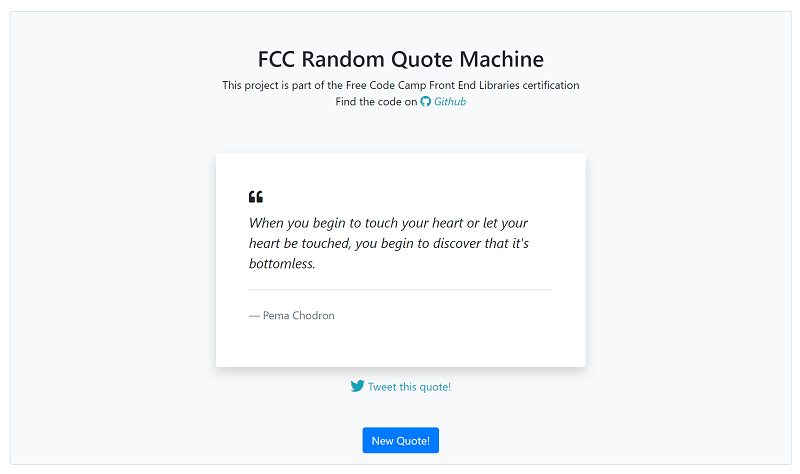

# Free Code Camp - Random Quote Machine

[](https://app.netlify.com/sites/fcc-randomquotemachine/deploys) 

This repo contains my submission for the Random Quote Machine project which is part of the Free Code Camp Front End Libraries certification.

## Demo

View a live demo of the app [here](http://fcc-randomquotemachine.netlify.com)



## Install

These instructions will get you a copy of the project up and running on your local machine for development and testing purposes. See deployment for notes on how to deploy the project on a live system.


### Installing

A step by step on running a local deployment environment.

Clone the repo

```
git clone https://github.com/duncanjbain/fcc_random_quote_machine.git
```

Install dependencies

```
npm install
```

Run a local live deployment

```
yarn start
```

## Built With

* [React](https://reactjs.org/) - The web framework used
* [Bootstrap](https://getbootstrap.com/) - CSS framework used
* [Fontawesome](https://fontawesome.com/) - Icons used

## Authors

* [Duncan Bain](https://github.com/duncanjbain)

## License

This project is licensed under the MIT License - see the [LICENSE.md](LICENSE.md) file for details

## Acknowledgments

* Luke Peavey for random quote API [https://github.com/lukePeavey/quotable](https://github.com/lukePeavey/quotable)
* Free Code Camp
